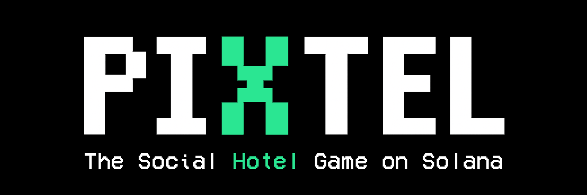

# Welcome to PIXTEL

<figure><figcaption></figcaption></figure>

## The Social Hotel Game on Solana

**PIXTEL** is a multiplayer pixel-art social game where players explore a virtual hotel, hang out in themed rooms, play competitive minigames, and interact with a crypto-native economy built on Solana.

Think of it as a retro-styled social world where you can:

- **Play minigames** — Challenge other players to Dice and 8-Ball Pool with real XIPS bets
- **Explore rooms** — Walk around bars, casinos, gyms, discos, and player-created spaces
- **Socialize** — Chat, add friends, send direct messages, and customize your avatar
- **Earn & spend** — Win XIPS through gameplay, buy items in the shop, and decorate your room
- **Connect your wallet** — Phantom wallet integration with Solana for token holders

## Quick Links

| Link | Description |
|------|-------------|
| [Play Now](https://play.pixtel.fun) | Jump into the game |
| [X (Twitter)](https://x.com/PIXTEL_fun/) | Follow for updates |
| [Telegram](https://t.me/PIXTEL_fun) | Join the community |

## How It Works

PIXTEL runs entirely in your browser as a WebGL application. No downloads required. Connect your Phantom wallet or create an account to start exploring the hotel, meeting other players, and competing in minigames.

The in-game currency **XIPS** powers the economy — bet on minigames, buy furniture, customize your cue stick, and more.
